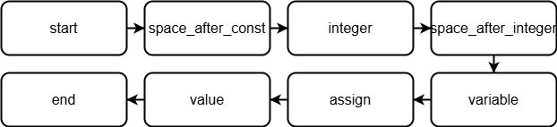
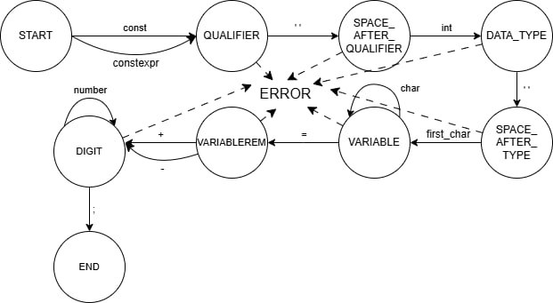

# Лабораторная работа 1
## Справка по текстовому редактору

### Пункты меню

- Файл → Создать (Ctrl+N) -  Создает новую вкладку с пустым текстовым файлом. Имя файла по умолчанию — "NewFileN.txt", где N — номер следующего файла.
- Файл → Открыть (Ctrl+O) - Открывает диалог для выбора текстового файла, который затем отображается в новой вкладке с именем файла.
- Файл → Сохранить (Ctrl+S) - Сохраняет содержимое текущей вкладки. Если файл уже имеет путь, сохраняет по нему; иначе открывает диалог "Сохранить как".
- Файл → Сохранить как - Открывает диалог для сохранения текущей вкладки под новым именем и в новом месте.
- Файл → Выход - Закрывает приложение с запросом сохранения всех измененных вкладок.
- Правка → Отменить - Отменяет последнее действие в текущей вкладке (например, удаление текста).
- Правка → Повторить - Повторяет отмененное действие в текущей вкладке.
- Правка → Вырезать - Вырезает выделенный текст из текущей вкладки в буфер обмена.
- Правка → Копировать - Копирует выделенный текст в буфер обмена.
- Правка → Вставить - Вставляет текст из буфера обмена в текущую вкладку.
- Правка → Удалить - Удаляет выделенный текст в текущей вкладке.
- Правка → Выделить все - Выделяет весь текст в текущей вкладке.
- Пуск - Запуск парсера, пока не реализован.
- Справка → Справка - Открывает этот документ с описанием функций приложения.
- Справка → О программе - Показывает окно с информацией о программе (версия, автор).

### Область ввода текста
Область ввода текста расположена в центральной части окна и представлена вкладками. Каждая вкладка соответствует открытому файлу и содержит:

- Номера строк - Слева от текста отображаются номера строк, которые автоматически обновляются при добавлении или удалении строк. Прокрутка номеров синхронизирована с текстом.
- Текстовый редактор - Основная область для ввода и редактирования текста. Поддерживает многострочный ввод, табуляцию и прокрутку при превышении видимой области.
- Закрытие вкладки - Крестик "×" на заголовке вкладки позволяет закрыть её с запросом сохранения изменений, если они есть.

Перетаскивание файла из проводника в область ввода открывает его как новую вкладку. Размер шрифта текста можно изменять через меню "Текст".
# Лабораторная работа 2
Персональный вариант: Объявление целочисленной константы с инициализацией на языке C/C++

## В соответствии с заданием второй лабораторной работы необходимо:
- Спроектировать диаграмму состояний сканера.
- Разработать лексический анализатор, позволяющий выделить в тексте лексемы, иные символы считать недопустимыми.
- Встроить сканер в ранее разработанный интерфейс текстового редактора. Учесть, что текст для разбора может состоять из множества строк.

Входные данные - строка (текст программного кода).
Выходные данные - последовательность условных кодов, описывающих структуру разбираемого текста с указанием места положения и типа ("число", "идентификатор", "знак", "недопустимый символ" и т.д.). 
Окно вывода результатов можно реализовать в виде таблицы (элемент управления DataGridView). Столбцы таблицы представляют собой условный код, тип лексемы, лексема и ее местоположение.
## Примеры допустимых строк:
- const int varB = 5;
- constexpr int varC = 7;
## Лексический сканер

## Тестовые примеры
Тестовые примеры:
1) Пример 1:
Входные данные: const int varB=5;

Выходные данные: 
Нерерминал - CONST; терминал - const; строка - 1; начальная позиция – 1; конечная позиция - 5.
тип - SPACE; значение – « » ; строка - 1; начальная позиция – 6; конечная позиция -  6.
тип - INT; значение – int ; строка - 1; начальная позиция - 7; конечная позиция - 9.
тип - SPACE; значение – « » ; строка - 1; начальная позиция – 10; конечная позиция -  10.
тип - IDENTIFIER; значение – varB ; строка - 1; начальная позиция – 11; конечная позиция -  14.
тип - ASSIGN; значение – = ; строка - 1; начальная позиция – 12; конечная позиция -  12.
тип - NUMBER; значение – 5 ; строка - 1; начальная позиция – 13; конечная позиция -  13.
тип - SEMICOLON; значение – ;  ; строка - 1; начальная позиция – 14; конечная позиция -  14.

2) Пример 2:
Входные данные: constexpr ?;
Выходные данные: 
тип - CONSTEXPR; значение - constexpr; строка - 1; начальная позиция – 1; конечная позиция - 9.
тип - SPACE; значение – « » ; строка - 1; начальная позиция – 10; конечная позиция -  10.
тип - INVALID; значение - invalid; строка - 1; начальная позиция – 11; конечная позиция - 11.
тип - SEMICOLON; значение – ;  ; строка - 1; начальная позиция – 12; конечная позиция -  12.

3) Пример 3:
Входные данные: 
inT;
const abs;
Banana;
Выходные данные: 
тип - IDENTIFIER; значение - inT; строка - 1; начальная позиция – 1; конечная позиция - 3.
тип - SEMICOLON; значение – ;  ; строка - 1; начальная позиция – 4; конечная позиция - 4.
тип - CONST; значение - const; строка - 2; начальная позиция – 1; конечная позиция - 5.
тип - SPACE; значение – « » ; строка - 2; начальная позиция – 6; конечная позиция -  6.
тип - IDENTIFIER; значение – abs ; строка - 2; начальная позиция – 7; конечная позиция -  9.
тип - SEMICOLON; значение – ;  ; строка - 2; начальная позиция – 10; конечная позиция - 10.
тип - IDENTIFIER; значение – Banana ; строка - 3; начальная позиция – 11; конечная позиция -  16.
тип - SEMICOLON; значение – ;  ; строка - 3; начальная позиция – 17; конечная позиция - 17.

# Лабораторная работа 3
Разработанная грамматика:
G[Z]
P:
<START>                 -> <QUALIFIER> <SPACE_AFTER_QUALIFIER>
<QUALIFIER>             -> 'const'
<QUALIFIER>             -> 'constexpr'
<SPACE_AFTER_QUALIFIER> -> ' ' <DATA_TYPE>
<DATA_TYPE>             -> 'int' <SPACE_AFTER_TYPE>
<SPACE_AFTER_TYPE>      -> ' ' <VARIABLE>
<VARIABLE>              -> first_char <VARIABLEREM>
<VARIABLEREM>           -> сhar <VARIABLEREM>
<VARIABLEREM>           -> '=' <CONST_VALUE>
<CONST_VALUE>           -> '+' <DIGIT>
<CONST_VALUE>           -> '-' <DIGIT>
<CONST_VALUE>           -> number <DIGITREM>
<DIGIT>                 -> number <DIGITREM>
<DIGITREM>              -> number <DIGITREM>
<DIGITREM>              -> ';' <END>
<END>                   -> ε

number                  -> '0' | '1' | '2' | '3' | '4' | '5' | '6' | '7' | '8' | '9'
first_char              -> 'a' | ... | 'z' | 'A' | ... | 'Z' | '_'
сhar                    -> 'a' | ... | 'z' | 'A' | ... | 'Z' | '_' | '0' | ... | '9'

Vn = {
    <START>, <QUALIFIER>, <SPACE_AFTER_QUALIFIER>, <DATA_TYPE>,
    <SPACE_AFTER_TYPE>, <VARIABLE>, <VARIABLEREM>, <CONST_VALUE>,
    <DIGIT>, <DIGITREM>, <END>
}

Vt = {
    'const', 'constexpr', 'int', ' ', '=', '+', '-', ';', '0' | ... | '9',
    'a' | ... | 'z' | 'A' | ... | 'Z', '_', number, first_char, сhar
}

Согласно классификации Хомского, грамматика G[‹START›] является автоматной.
Рисунок 2 - Схема работы процедур

Рисунок 2 - Граф конечного автомата

# Лабораторная работа 4

Разработанная грамматика:
G[Z]
P:
<START>                 -> <QUALIFIER> <SPACE_AFTER_QUALIFIER>
<QUALIFIER>             -> 'const'
<QUALIFIER>             -> 'constexpr'
<SPACE_AFTER_QUALIFIER> -> ' ' <DATA_TYPE>
<DATA_TYPE>             -> 'int' <SPACE_AFTER_TYPE>
<SPACE_AFTER_TYPE>      -> ' ' <VARIABLE>
<VARIABLE>              -> first_char <VARIABLEREM>
<VARIABLEREM>           -> сhar <VARIABLEREM>
<VARIABLEREM>           -> '=' <CONST_VALUE>
<CONST_VALUE>           -> '+' <DIGIT>
<CONST_VALUE>           -> '-' <DIGIT>
<CONST_VALUE>           -> number <DIGITREM>
<DIGIT>                 -> number <DIGITREM>
<DIGITREM>              -> number <DIGITREM>
<DIGITREM>              -> ';' <END>
<END>                   -> ε

number                  -> '0' | '1' | '2' | '3' | '4' | '5' | '6' | '7' | '8' | '9'
first_char              -> 'a' | ... | 'z' | 'A' | ... | 'Z' | '_'
сhar                    -> 'a' | ... | 'z' | 'A' | ... | 'Z' | '_' | '0' | ... | '9'

Vn = {
    <START>, <QUALIFIER>, <SPACE_AFTER_QUALIFIER>, <DATA_TYPE>,
    <SPACE_AFTER_TYPE>, <VARIABLE>, <VARIABLEREM>, <CONST_VALUE>,
    <DIGIT>, <DIGITREM>, <END>
}

Vt = {
    'const', 'constexpr', 'int', ' ', '=', '+', '-', ';', '0' | ... | '9',
    'a' | ... | 'z' | 'A' | ... | 'Z', '_', number, first_char, сhar
}

Согласно классификации Хомского, грамматика G[‹START›] является автоматной.
Рисунок 2 - Схема работы процедур

Рисунок 2 - Граф конечного автомата

